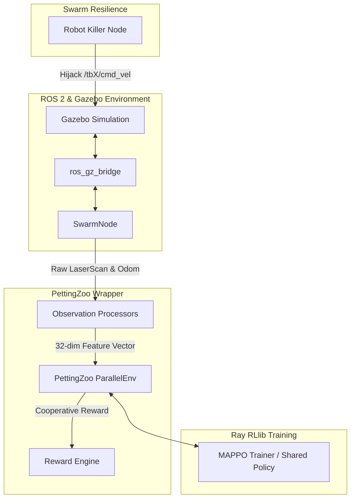

# MARS: Multi-Agent Robot Swarm Navigation & Area Coverage

MARS (Multi-Agent Robot Swarm) is a state-of-the-art framework for cooperative area coverage and navigation utilizing a swarm of homogeneous TurtleBot3 Waffle robots. The system is built on **ROS 2 Jazzy**, **Gazebo Sim**, **PettingZoo**, and **Ray RLlib (MAPPO)**.



---

## Key Features

1. **Robust Environment Isolation:** Namespaced spawn configurations launching multiple TurtleBot3 Waffles (`tb1`, `tb2`, `tb3`) with fully isolated topic parameter bridges.
2. **Cooperative Area Coverage Reward:** A grid-based $10 \times 10$ tracking map. The swarm receives collective rewards whenever any active robot explores a previously unvisited sector.
3. **Multi-Agent Reinforcement Learning (MARL):** Policy sharing MAPPO (Multi-Agent PPO) algorithm implementation using PyTorch under Ray RLlib.
4. **Transient Noise Rejection:** Custom settling delays (2.0s post-reset) and ROS 2 event flushes to prevent transient start-of-episode Lidar collision reports.
5. **Fault-Tolerant Resilience Testing:** An independent ROS 2 node (`robot_killer`) designed to hijack and disable individual robots mid-episode to evaluate swarm adaptation capabilities.
6. **Dual GUI Visualization (Gazebo + RViz):** Runs the physical Gazebo simulator and RViz2 side-by-side. A custom `tf_relay` node merges namespaced `/tbX/tf` transforms, and static transform publishers link them under a single root frame (`tb1/odom`) to view all robots, odometry paths, and colored LaserScan point clouds dynamically in one view.

---

## Installation & Setup

### 1. Source ROS 2 Environment
Make sure your ROS 2 Jazzy system is sourced:
```bash
source /opt/ros/jazzy/setup.bash
```

### 2. Install Workspace Dependencies
Ensure all workspace packages are built:
```bash
colcon build --symlink-install
source install/setup.bash
```

---

## How to Run (Unified Command Runner)

We provide a unified launcher script `run_swarm.sh` to automate workspace sourcing, package building, node execution, failure injection, and ROS recording.

### 1. Launch Swarm Random Demo (with GUI)
To visualize the multi-robot setup and random movement in the Gazebo sandbox:
```bash
./run_swarm.sh --demo
```

### 2. Multi-Agent MAPPO Training (Headless)
To start distributed multi-agent training with Ray RLlib and PyTorch:
```bash
./run_swarm.sh --train
```

### 3. Policy Checkpoint Evaluation
To run greedy evaluation episodes using a saved training checkpoint:
* **Headless Mode:**
  ```bash
  ./run_swarm.sh --evaluate ./checkpoints/checkpoint_000002
  ```
* **Visual Mode (Gazebo GUI):**
  ```bash
  ./run_swarm.sh --play ./checkpoints/checkpoint_000002
  ```

### 4. Swarm Resilience & Failure Injection Test
To evaluate the swarm's self-healing and adaptation capabilities when a robot suddenly fails:
```bash
./run_swarm.sh --resilience ./checkpoints/checkpoint_000002
```
*This command runs the policy evaluation in the Gazebo GUI and automatically triggers the `robot_killer` failure injection node after 18 seconds. You can visually observe the remaining active robots dynamically taking over the navigation duties of the disabled robot.*

### 5. Record ROS 2 Bags
To record sensor data and odom profiles during evaluation:
```bash
./run_swarm.sh --record ./checkpoints/checkpoint_000002
```
*This records a ROS 2 bag containing namespaced `/tbX/odom` and `/tbX/scan` topics for offline analysis.*

### 6. Quantitative Benchmarking & Plotting
To benchmark your policy against standard baseline control groups (Random Walk and Frontier Heuristic) under noise/failures, run:
```bash
# Evaluate only Random Walk & Heuristic control baselines
./run_swarm.sh --benchmark

# Evaluate full suite including your trained MAPPO policy checkpoint
./run_swarm.sh --benchmark ./checkpoints/checkpoint_000002
```
This runs evaluation episodes under nominal, sensor noise (Gaussian noise added to Lidar scan observations), and agent failure conditions. It outputs summary stats (Area Coverage Rate, overlap redundancy, distance traveled) and saves a comparison box-and-whisker plot to `./checkpoints/benchmark_results.png`.

---

## Observation Space Details (32-Dim Vector)
Each robot receives a state observation vector containing:
- **`[0 - 23]`:** Minimum range sub-sampled across 24 Lidar sectors.
- **`[24 - 25]`:** Relative Goal distance and orientation angle.
- **`[26 - 27]`:** Linear and angular command velocities.
- **`[28 - 31]`:** Neighbor relative states (distances and angles to closest active neighbors).

