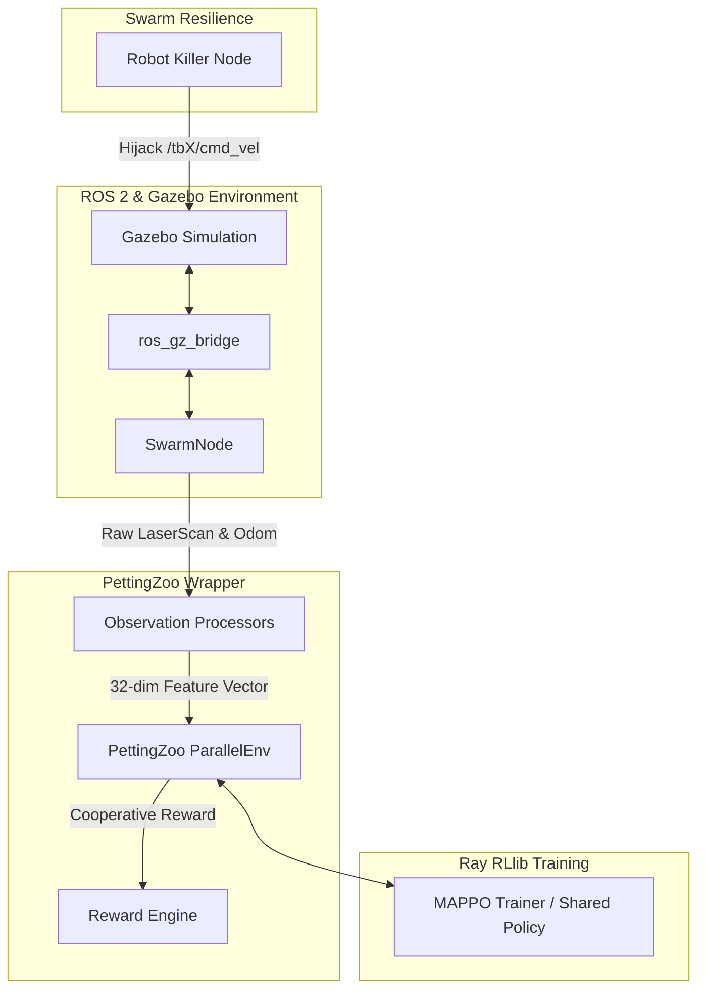

# MARS: Multi-Agent Robot Swarm Navigation & Area Coverage

MARS (Multi-Agent Robot Swarm) is a state-of-the-art framework for cooperative area coverage and navigation utilizing a swarm of homogeneous TurtleBot3 Waffle robots. The system is built on **ROS 2 Jazzy**, **Gazebo Sim**, **PettingZoo**, and **Ray RLlib (MAPPO)**.


```mermaid
graph TD
    subgraph ROS 2 & Gazebo Environment
        GZ[Gazebo Simulation] <--> Bridge[ros_gz_bridge]
        Bridge <--> Node[SwarmNode]
    end

    subgraph PettingZoo Wrapper
        Node --> |Raw LaserScan & Odom| Obs[Observation Processors]
        Obs --> |32-dim Feature Vector| Env[PettingZoo ParallelEnv]
        Env --> |Cooperative Reward| Rwd[Reward Engine]
    end

    subgraph Ray RLlib Training
        Env <--> MAPPO[MAPPO Trainer / Shared Policy]
    end

    subgraph Swarm Resilience
        Killer[Robot Killer Node] --> |Hijack /tbX/cmd_vel| GZ
    end
```

---

## System Architecture & Module Map

| Module | Location | Description & Role |
| :--- | :--- | :--- |
| **Micro-QP CBF Solver** | [`cbf_qp_solver.py`](file:///home/harsh-pandhe/GitHub/MARS/src/mars_swarm/mars_swarm/cbf_qp_solver.py) | High-speed C-accelerated OSQP quadratic program solver ($24\text{ }\mu\text{s}$) filtering nominal velocity commands. Enforces dual-lookahead front/rear collision barriers ($d_{safe}^{obs}=0.20\text{m}$) and inter-agent relative distance barriers ($d_{safe}^{agent}=0.45\text{m}$). |
| **Decentralized Coordinator** | [`decentralized_coordinator.py`](file:///home/harsh-pandhe/GitHub/MARS/src/mars_swarm/mars_swarm/decentralized_coordinator.py) | Fully decentralized swarm coordinator using Dynamic Voronoi cell partitioning and Consensus-Based Bundle Auction (CBAA) protocol over simulated range-limited radio ($d_{comm} \le 3.0\text{m}$). |
| **Behavior Tree Controller** | [`mission_behavior_tree.py`](file:///home/harsh-pandhe/GitHub/MARS/src/mars_swarm/mars_swarm/mission_behavior_tree.py) | Formal `py_trees` mission state machine. Manages stuck recovery maneuvers, frontier exploration, and boundary-safe perimeter patrol upon coverage saturation. |
| **Scan-Matching Localizer** | [`scan_matching_localizer.py`](file:///home/harsh-pandhe/GitHub/MARS/src/mars_swarm/mars_swarm/scan_matching_localizer.py) | 2D Correlative Distance-Field scan matcher (`cv2.distanceTransform`) matching LiDAR scans against known map obstacles, eliminating wheel slip and dead-reckoning drift over long horizons. |
| **Swarm Telemetry Engine** | [`swarm_telemetry.py`](file:///home/harsh-pandhe/GitHub/MARS/src/mars_swarm/mars_swarm/swarm_telemetry.py) | Real-time telemetry logger streaming scalar curves to TensorBoard and exporting structured `run_summary.json` manifests (ACR curve, normalized energy $\int(v^2+\omega^2)dt$, MTBD, and clearance distribution). |
| **Multi-Env Simulation Wrapper** | [`multi_env_wrapper.py`](file:///home/harsh-pandhe/GitHub/MARS/src/mars_swarm/mars_swarm/multi_env_wrapper.py) | PettingZoo parallel multi-agent environment with vectorized OpenCV C++ grid raycasting, inter-agent Active Collision Avoidance (ACAS), and ROS 2 Jazzy bridge coordination. |

---

## Key Features

1. **Deterministic Single-Threaded Physics:** World configurations (`cafe.sdf`, `warehouse.sdf`) configure single-threaded ODE solvers (`<thread_count>1</thread_count>`) and pass explicit PRNG seeds via `--seed` for 100% bitwise-reproducible benchmark replays.
2. **Robust Environment Isolation:** Namespaced spawn configurations launching multiple TurtleBot3 Waffles (`tb1`, `tb2`, `tb3`) with fully isolated topic parameter bridges.
3. **Cooperative Area Coverage Reward:** High-resolution occupancy and coverage grids with obstacle cell exclusion for fair ACR evaluation.
4. **Multi-Agent Reinforcement Learning (MARL):** Policy sharing MAPPO (Multi-Agent PPO) algorithm implementation using PyTorch under Ray RLlib.
5. **Transient Noise Rejection:** Custom settling delays and ROS 2 event flushes to prevent transient start-of-episode collision reports.
6. **Fault-Tolerant Resilience Testing:** An independent ROS 2 node (`robot_killer`) designed to hijack and disable individual robots mid-episode to evaluate swarm adaptation capabilities.
7. **Dual GUI Visualization (Gazebo + RViz):** Runs Gazebo Sim and RViz2 side-by-side with synchronized robot frames, odometry paths, and colored LaserScan point clouds.
8. **Automated CI/CD Regression Pipeline:** GitHub Actions workflow executing the 30-test suite across CBF safety, A* pathfinding, Voronoi partitioning, and telemetry.

---

## Installation & Setup

### 1. Source ROS 2 Environment
Make sure your ROS 2 Jazzy system is sourced:
```bash
source /opt/ros/jazzy/setup.bash
```

### 2. Install Workspace Dependencies
Ensure all workspace packages are built:
```bash
colcon build --symlink-install
source install/setup.bash
```

---

## How to Run (Unified Command Runner)

We provide a unified launcher script `run_swarm.sh` to automate workspace sourcing, package building, node execution, failure injection, and ROS recording.

### 1. Launch Swarm Random Demo (with GUI)
To visualize the multi-robot setup and random movement in the Gazebo sandbox:
```bash
./run_swarm.sh --demo
```

### 1a. One-Command Area Coverage Demo (Frontier Heuristic, GUI)
Runs all 3 robots exploring the cafe world with a nearest-unvisited-cell frontier heuristic (no trained policy required) for up to 1200 steps, then saves a coverage heatmap plot. This is the most reliable single-command way to see high-coverage swarm exploration end to end:
```bash
./run_swarm.sh --coverage-demo
```
Prints final area coverage % and saves a heatmap to `./ros_bags/coverage_plot_<timestamp>.png`.

### 2. Multi-Agent MAPPO Training (Headless)
To start distributed multi-agent training with Ray RLlib and PyTorch:
```bash
./run_swarm.sh --train
```

### 3. Policy Checkpoint Evaluation
To run greedy evaluation episodes using a saved training checkpoint (continuous exploration up to 1200 steps per episode). Coverage quality depends on how well-trained the checkpoint is — for a reliable high-coverage demo independent of policy quality, use `--coverage-demo` above instead. Optionally pass an episode count (default 5):
* **Headless Mode:**
  ```bash
  ./run_swarm.sh --evaluate ./checkpoints 1
  ```
* **Visual Mode (Gazebo GUI):**
  ```bash
  ./run_swarm.sh --play ./checkpoints 1
  ```
Each episode prints final area coverage % and saves a coverage heatmap plot to `./ros_bags/coverage_plot_<timestamp>.png`.

### 4. Swarm Resilience & Failure Injection Test
To evaluate the swarm's self-healing and adaptation capabilities when a robot suddenly fails:
```bash
./run_swarm.sh --resilience ./checkpoints
```
*This command runs the policy evaluation in the Gazebo GUI and automatically triggers the `robot_killer` failure injection node after 18 seconds. You can visually observe the remaining active robots dynamically taking over the navigation duties of the disabled robot.*

### 5. Record ROS 2 Bags
To record sensor data and odom profiles during evaluation:
```bash
./run_swarm.sh --record ./checkpoints
```
*This records a ROS 2 bag containing namespaced `/tbX/odom` and `/tbX/scan` topics for offline analysis.*

### 6. Quantitative Benchmarking & Plotting
To benchmark your policy against standard baseline control groups (Random Walk and Frontier Heuristic) under noise/failures, run:
```bash
# Evaluate only Random Walk & Heuristic control baselines
./run_swarm.sh --benchmark

# Evaluate full suite including your trained MAPPO policy checkpoint
./run_swarm.sh --benchmark ./checkpoints
```
This runs evaluation episodes under nominal, sensor noise (Gaussian noise added to Lidar scan observations), and agent failure conditions. It outputs summary stats (Area Coverage Rate, overlap redundancy, distance traveled) and saves a comparison box-and-whisker plot to `./checkpoints/benchmark_results.png`.

---

## Observation Space Details (46-Dim Vector)
Each robot receives a state observation vector containing:
- **`[0 - 23]`:** Minimum range sub-sampled across 24 Lidar sectors.
- **`[24 - 25]`:** Relative Goal distance and orientation angle.
- **`[26 - 27]`:** Linear and angular command velocities.
- **`[28 - 45]`:** Neighbor relative states (relative distances and angles to up to 9 neighbors, padded with default values `[10.0, 0.0]`).


