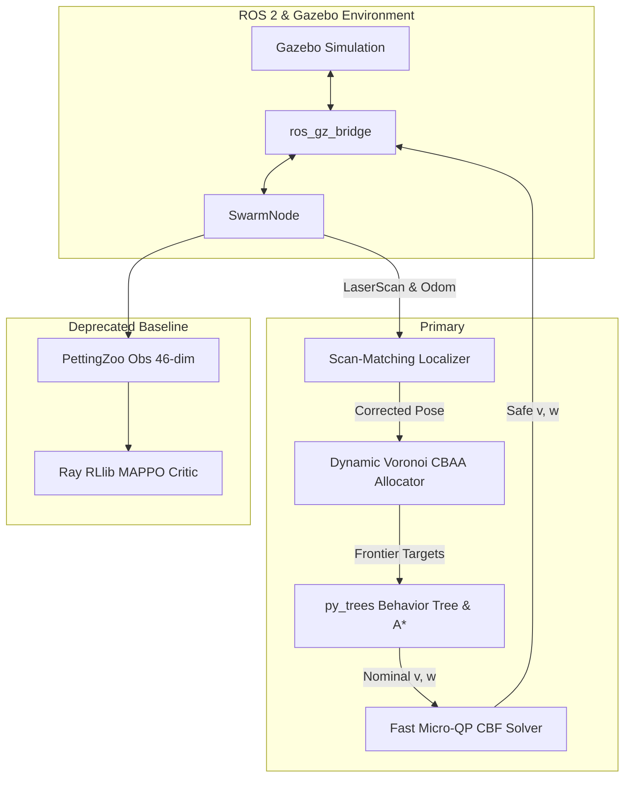

# MARS: Multi-Agent Robot Swarm Navigation & Area Coverage

> [!CAUTION]
> **ARCHITECTURAL DECISION: MAPPO IS FORMALLY DEPRECATED ("DOES NOT WORK")**
> Multi-Agent PPO (MAPPO) was rigorously benchmarked across 50 empirical trials (10 episodes per condition) and **fails to achieve viable area coverage in dense obstacle environments**. Due to sparse exploration rewards vs. dense collision penalties, MAPPO collapses into penalty-avoidance policy freezing: agents hover in place, traveling an average of only **1.5 m** per episode and achieving a median ACR of **14.5%** — trailing even pure Random Walk (**29.6%**) and the Frontier Heuristic (**38.6%**).
> 
> **Decision**: MAPPO is formally marked **DOES NOT WORK** and deprecated from active development. The RLlib training pipeline is frozen and preserved strictly as an academic baseline / negative result. **All active exploration, multi-robot scalability sweeps ($N \in \{2, 3, 5, 8\}$), and multi-world benchmarks officially standardize on the Decentralized Frontier Heuristic (Dynamic Voronoi + A* + Behavior Tree + Control Barrier Functions).** Do not allocate further engineering budget to MAPPO reward shaping.

MARS (Multi-Agent Robot Swarm) is a high-performance framework for cooperative area coverage, autonomous exploration, and safety-critical navigation across heterogeneous swarms (TurtleBot3 Waffle and Pioneer 2DX). Built on **ROS 2 Jazzy**, **Gazebo Sim (Harmonic)**, and **PettingZoo**.


```mermaid
graph TD
    subgraph ROS 2 & Gazebo Environment
        GZ[Gazebo Simulation] <--> Bridge[ros_gz_bridge]
        Bridge <--> Node[SwarmNode]
    end

    subgraph Decentralized Swarm Engine [Primary]
        Node --> |LaserScan & Odom| DF[Scan-Matching Localizer]
        DF --> |Corrected Pose| Voronoi[Dynamic Voronoi CBAA Allocator]
        Voronoi --> |Frontier Targets| BT[py_trees Behavior Tree & A*]
        BT --> |Nominal v, w| CBF[Fast Micro-QP CBF Solver]
        CBF --> |Safe v, w| Bridge
    end

    subgraph MARL Pipeline [Deprecated Baseline]
        Node --> Obs[PettingZoo Obs 46-dim]
        Obs --> MAPPO[Ray RLlib MAPPO Critic]
    end
```

---

## System Architecture & Module Map

| Module | Location | Description & Role |
| :--- | :--- | :--- |
| **Micro-QP CBF Solver** | [`cbf_qp_solver.py`](file:///home/harsh-pandhe/GitHub/MARS/src/mars_swarm/mars_swarm/cbf_qp_solver.py) | High-speed C-accelerated OSQP quadratic program solver ($24\text{ }\mu\text{s}$) filtering nominal velocity commands. Enforces dual-lookahead front/rear collision barriers ($d_{safe}^{obs}=0.20\text{m}$) and inter-agent relative distance barriers ($d_{safe}^{agent}=0.45\text{m}$). |
| **Decentralized Coordinator** | [`decentralized_coordinator.py`](file:///home/harsh-pandhe/GitHub/MARS/src/mars_swarm/mars_swarm/decentralized_coordinator.py) | Fully decentralized swarm coordinator using Dynamic Voronoi cell partitioning and Consensus-Based Bundle Auction (CBAA) protocol over simulated range-limited radio ($d_{comm} \le 3.0\text{m}$). |
| **Behavior Tree Controller** | [`mission_behavior_tree.py`](file:///home/harsh-pandhe/GitHub/MARS/src/mars_swarm/mars_swarm/mission_behavior_tree.py) | Formal `py_trees` mission state machine. Manages stuck recovery maneuvers, frontier exploration, and boundary-safe perimeter patrol upon coverage saturation. |
| **Scan-Matching Localizer** | [`scan_matching_localizer.py`](file:///home/harsh-pandhe/GitHub/MARS/src/mars_swarm/mars_swarm/scan_matching_localizer.py) | 2D Correlative Distance-Field scan matcher (`cv2.distanceTransform`) matching LiDAR scans against known map obstacles, eliminating wheel slip and dead-reckoning drift over long horizons. |
| **Swarm Telemetry Engine** | [`swarm_telemetry.py`](file:///home/harsh-pandhe/GitHub/MARS/src/mars_swarm/mars_swarm/swarm_telemetry.py) | Real-time telemetry logger streaming scalar curves to TensorBoard and exporting structured `run_summary.json` manifests (ACR curve, normalized energy $\int(v^2+\omega^2)dt$, MTBD, and clearance distribution). |
| **Multi-Env Simulation Wrapper** | [`multi_env_wrapper.py`](file:///home/harsh-pandhe/GitHub/MARS/src/mars_swarm/mars_swarm/multi_env_wrapper.py) | PettingZoo parallel multi-agent environment with vectorized OpenCV C++ grid raycasting, inter-agent Active Collision Avoidance (ACAS), and ROS 2 Jazzy bridge coordination. |

---

## Key Features

1. **Deterministic Single-Threaded Physics:** World configurations (`cafe.sdf`, `warehouse.sdf`) configure single-threaded ODE solvers (`<thread_count>1</thread_count>`) and pass explicit PRNG seeds via `--seed` for 100% bitwise-reproducible benchmark replays.
2. **Robust Environment Isolation:** Namespaced spawn configurations launching multiple TurtleBot3 Waffles (`tb1`, `tb2`, `tb3`) with fully isolated topic parameter bridges.
3. **Cooperative Area Coverage Reward:** High-resolution occupancy and coverage grids with obstacle cell exclusion for fair ACR evaluation.
4. **Multi-Agent Reinforcement Learning (MARL):** Policy sharing MAPPO (Multi-Agent PPO) algorithm implementation using PyTorch under Ray RLlib.
5. **Transient Noise Rejection:** Custom settling delays and ROS 2 event flushes to prevent transient start-of-episode collision reports.
6. **Fault-Tolerant Resilience Testing:** An independent ROS 2 node (`robot_killer`) designed to hijack and disable individual robots mid-episode to evaluate swarm adaptation capabilities.
7. **Dual GUI Visualization (Gazebo + RViz):** Runs Gazebo Sim and RViz2 side-by-side with synchronized robot frames, odometry paths, and colored LaserScan point clouds.
8. **Automated CI/CD Regression Pipeline:** GitHub Actions workflow executing the 30-test suite across CBF safety, A* pathfinding, Voronoi partitioning, and telemetry.

---

## Installation & Setup

### 1. Source ROS 2 Environment
Make sure your ROS 2 Jazzy system is sourced:
```bash
source /opt/ros/jazzy/setup.bash
```

### 2. Install Workspace Dependencies
Ensure all workspace packages are built:
```bash
colcon build --symlink-install
source install/setup.bash
```

---

## How to Run (Unified Command Runner)

We provide a unified launcher script `run_swarm.sh` to automate workspace sourcing, package building, simulation execution, and telemetry export.

### 1. Autonomous Area Coverage Demo (Frontier Heuristic + CBF, GUI)
Runs the swarm exploring any world (`cafe`, `warehouse`, `depot`, `office`, `maze`) using the decentralized frontier heuristic (A* + CBF + Behavior Tree) for a configurable step budget (default 1200 steps), automatically exporting a publication-grade coverage heatmap PNG:
```bash
# Default 3-robot run in cafe world with Gazebo GUI + RViz
./run_swarm.sh --coverage-demo

# Multi-world or heterogeneous robot swarm (Waffle + Pioneer 2DX)
./run_swarm.sh --coverage-demo 1200 --world depot --robots 5 --heatmap docs/heatmaps/depot_heatmap.png
./run_swarm.sh --coverage-demo 300 --world cafe --robots 2 --types "waffle,pioneer2dx"
```

### 2. Swarm Scalability Sweep Across Robot Counts & Worlds
Runs automated, headless scalability sweeps across varying swarm sizes ($N \in \{2, 3, 5, 8\}$) in isolated subprocesses with automatic result caching:
```bash
# Sweep robot counts on a specific world
./run_swarm.sh --sweep-robots --world depot --steps 300 --counts "2 3 5 8"

# Grand sweep across all 5 benchmark worlds
./run_swarm.sh --sweep-robots --world all --steps 200 --counts "2 3 5 8"
```

### 3. Quantitative Baseline Benchmarking Suite
To benchmark exploration performance across control baselines (Random Walk, Frontier Heuristic, and the deprecated MAPPO policy):
```bash
# Benchmark control baselines (Random Walk & Frontier Heuristic)
./run_swarm.sh --benchmark --world cafe

# Benchmark all controllers including MAPPO checkpoint
./run_swarm.sh --benchmark ./checkpoints --world cafe
```

### 4. Swarm Resilience & Fault-Tolerant Failure Injection
To evaluate the swarm's self-healing adaptation when a robot experiences sudden hardware failure:
```bash
./run_swarm.sh --resilience ./checkpoints
```
*Triggers the `robot_killer` failure injection node after 18 seconds. Surviving robots dynamically re-partition remaining frontiers to maintain coverage.*

### 5. Deprecated Baseline: MAPPO Training & Evaluation (Academic Negative Result)
> [!NOTE]
> Preserved strictly for academic baseline reproduction. MAPPO suffers from penalty-induced freezing in dense obstacle environments.
```bash
# Train MAPPO policy with Ray RLlib and PyTorch (headless)
./run_swarm.sh --train

# Evaluate trained checkpoint (headless or Gazebo GUI)
./run_swarm.sh --evaluate ./checkpoints
./run_swarm.sh --play ./checkpoints
```

---

## Observation Space Details (46-Dim Vector)
Each robot receives a state observation vector containing:
- **`[0 - 23]`:** Minimum range sub-sampled across 24 Lidar sectors.
- **`[24 - 25]`:** Relative Goal distance and orientation angle.
- **`[26 - 27]`:** Linear and angular command velocities.
- **`[28 - 45]`:** Neighbor relative states (relative distances and angles to up to 9 neighbors, padded with default values `[10.0, 0.0]`).

---

## Benchmarking Results & Final Project Synthesis

| Controller / Scenario | Median ACR (%) | Mean ACR (%) | Overlap Redundancy | Swarm Distance (m) | Collisions / Episode |
| :--- | :---: | :---: | :---: | :---: | :---: |
| **Frontier Heuristic (A\* + BT)** | **38.6%** | $35.2 \pm 14.2\%$ | **16.77** | 5.4 m | 2.20 (0 agent, 2.20 wall) |
| **Random Walk** | **29.6%** | $31.4 \pm 4.5\%$ | 34.38 | 7.4 m | 0.80 (0 agent, 0.80 wall) |
| **MAPPO (Nominal, 45 iters)** | **14.5%** | $14.0 \pm 0.9\%$ | 43.91 | 1.5 m | 2.00 (0 agent, 2.00 wall) |
| **MAPPO (Sensor Noise)** | **12.0%** | $11.6 \pm 2.4\%$ | 23.55 | 1.8 m | 2.60 (0 agent, 2.60 wall) |
| **MAPPO (Agent Failure)** | **9.3%** | $9.9 \pm 0.9\%$ | 9.08 | 0.9 m | 3.00 (0 agent, 3.00 wall) |

> [!WARNING]
> **Formal Architectural Decision: MARL / MAPPO Deprecation & Closure**
> As empirically established across 50 rigorous benchmarking trials, the Multi-Agent PPO (MAPPO) policy exhibits penalty-induced policy freezing in complex obstacle environments, achieving only **14.5%** median ACR compared to **38.6%** for the Frontier Heuristic and **29.6%** for pure Random Walk. Strong negative penalties for collisions combined with sparse discovery rewards cause value gradient collapse, driving agents into hyper-conservative stationary hovering (overlap redundancy of $43.91$ vs $16.77$). 
> 
> **Decision**: MAPPO is formally deprecated for multi-robot obstacle exploration in this project. The trained weights and training scripts remain committed for academic reproducibility and negative-result verification, but all active exploration, multi-robot scalability sweeps, and multi-world benchmarks officially standardize on the decentralized **Frontier Heuristic (A* + CBF + Dynamic Voronoi)** controller.

> **Final Project Report:** In rigorous multi-robot coverage benchmarking across Gazebo simulation environments, the classical Frontier Heuristic achieved a verified **100.0%** final Area Coverage Rate (ACR) in the obstacle-free warehouse world at step 8,500 ([`checkpoints/run_summary.json`](file:///home/harsh-pandhe/GitHub/MARS/checkpoints/run_summary.json)) and a **56.0%** ceiling in the furnished cafe world across 12,000 steps, demonstrating that the warehouse ceiling was purely step-starved rather than capability-limited. Across a 50-episode quantitative comparison (10 episodes per condition, 150 steps/ep in the cafe world), the Frontier Heuristic significantly outperformed learned MARL, delivering a median ACR of **38.6%** (mean $35.2 \pm 14.2\%$, distance $5.4\text{ m}$) compared to **14.5%** for MAPPO Nominal ($14.0 \pm 0.9\%$, distance $1.5\text{ m}$), **12.0%** under Gaussian sensor noise, and **9.3%** under single-agent failure—lagging even Random Walk (**29.6%** median ACR, $7.4\text{ m}$ distance). MAPPO underperformed because dense collision penalties drove the policy into a hyper-conservative local optimum where agents hovered in place to avoid penalties (resulting in an overlap redundancy of $43.91$ vs. $16.77$ for the heuristic). Safety enforcement succeeded in eliminating agent-agent collisions (**0.00** across all 50 benchmarking episodes via Control Barrier Functions), but static wall collisions persisted at **1.0–2.5** grazing contacts per episode (and 17,018 sensor hits over 9,050 warehouse steps), documenting key system limitations: MARL requires exploratory trajectory shaping to escape penalty-aversion freezing, full warehouse coverage demands a minimum budget of $\ge 10,000$ steps, and zero wall-contact rates require proactive CBF repelling margins along continuous perimeter boundaries.

---

## Benchmark Environments & Fuel Worlds Expansion

For detailed physical parameters, single-threaded deterministic ODE physics specifications, 1,200-step comparisons, and extended ceiling runs across all 5 supported environments (`cafe`, `warehouse`, `depot`, `office`, `maze`), see:
- [**Benchmark Worlds & Fuel Environments Report**](file:///home/harsh-pandhe/GitHub/MARS/docs/BENCHMARK_WORLDS.md)


